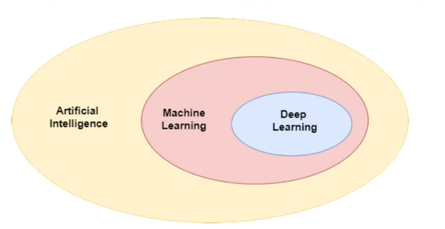
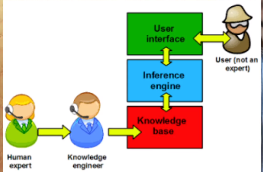

# Day 2

## AI vs ML vs DL

 

- **AI** ==> pattern recognition
  - Intelligent machines
  - Symbolic AI ==> Knowledge system using if/else
  - Symbolic turned into expert system.
    - 
    - but they failed at fuzzy logics like lung cancers detection, voice recognition.
- **ML** ==> Machine learning is a field of computer science that uses statistical knowledge to help computers learn with data , without being explicitly prigrammed.
  - Different from AI as donot have explicit programming.
  - System finds the pattern not the human.
  - More like  statics but not entirely

- **DL**
  - What ==> a subpart of machine learing but algos are more like insipired from  our biology structure(neuron).
  - Where ML failed ==> We have to specify/define features in machine learning, but deep learing automatically detects it. That is knowledge fo DB is required.
  - deep learing performance improves with the availability of the data.

Smaller data ==> go for ML
Bigger Data ==> go for DL
