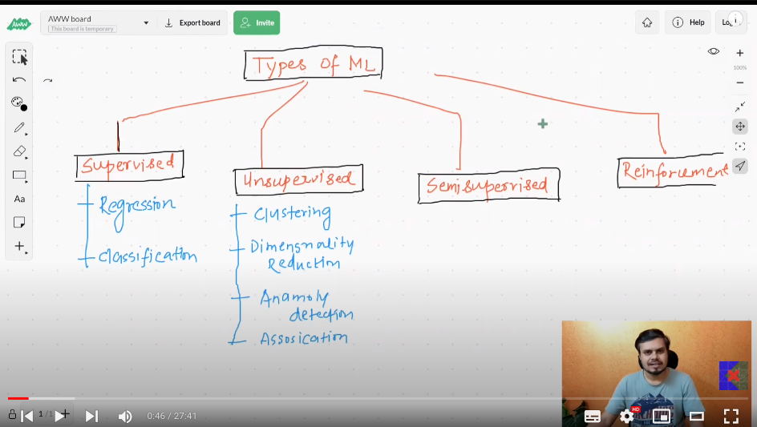
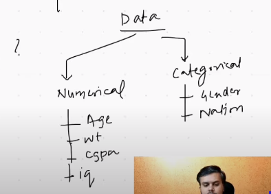
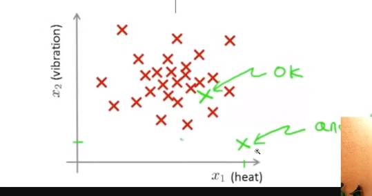
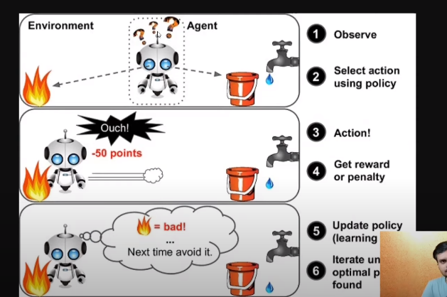

# Types of ML

## How much external-supervison is required in the field of ML

## types of data

## Supervised Learning

- When we have both input and output data.
- Majorly ml recides here.

- Two types
  - Regression
    - Output is Numerical data
  - Classification
    - Outpur is classification data .

## unsupervised Machine Learning

- Do-not have output.
- Donot know how and what to predict

- Types
  - **Clustering**
    - Used for grouping the data into categories.
    - For example, want to knwo types of customers we are having.
  - **Dimensionality Reduction**
    - Have a large number of input columns  ==> slow algo, after a particular number increasing the number of columns, doesnt affect the result.
    - These algos generally convert similar types of dimesnsions into a single one. i.e. **feature Extraction/PCA**
    - Secondly used for data visualization when the data has n-columns, because a visual graph can have at max 3 columns
  - **Anamoly Detection**
    - Look at the down one green pint, which is completely different from the older dataset.
    - 
  - Association Rule Learning
    - setting a huge variety of products accordingly, like in super-markets
    - **Steps** ==> `Data Mining`generation Bills of previous records ==> `Draw conclucionspattern generation(Like when someone brought milk, he/she also brought eggs). Also, in walmart, diapers are kept with bears.

## Semi Supervised

- When low data is there
- or data generation is expensive

- Example ==> Google photos face recognition.

- Unsupervised se ek jaise faces ko ekthe/cluster kr liya and then user se puch kr ki kon hai, unhe ektha kr diya

## Reinforcement

- no data
- Starts from scrath
- for example, we join college and do mistakes and learn from them
- Example ==> Self driving cars

- **reward punishment policy model**
