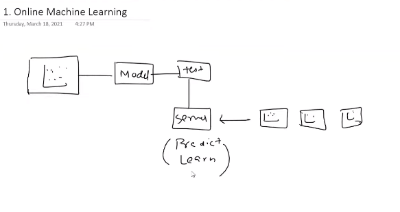
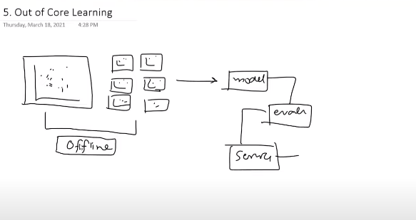
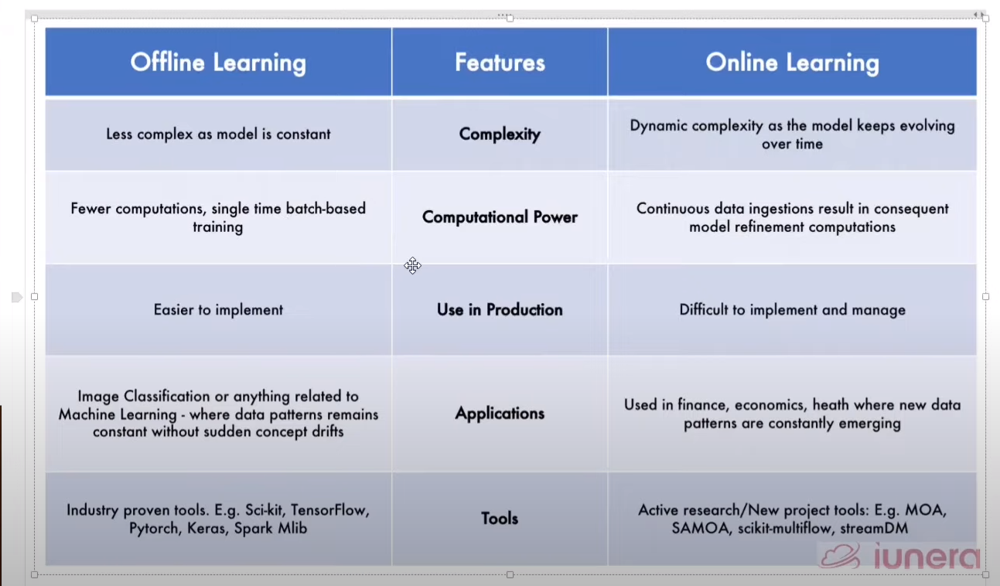

# Online Machine Learning

- Example : companies tend to say that our product will improve more and more as much as you will use it.

- It is done inctrementally
- model is feed data in batches in sequence `Mini Batch`
- Since the batch is short, we can do the training on the server itself.

- **Process**
- 

- Example
  - Chatbots
  - Swift keyboards (Personalised auto text completion as more and more we use the keyboard)
  - Youtube feed updates as soon as we click any feed.

## when to use batch and online learning

Online Learing is used when
    - there is a **concept drift**
        - We made a model for a particular problem , but the nature of the problem tends to change over the time.
    - **Cost Effective**
    - **Faster Solution**

## How it is implemented

- `SGDRegressor` provided by `sklearn`
  - has both
    - `fit` method
    - `partial_fit` method

- Can use `river` library
- can use `vowpal wabbit` library.
  - used for both reinforcement as well as online learning

## Learning Rate

- Tells how frequently we are going to train the model
- We do not train model on every incoming point
  - This changes the model at a very fast pace.
  - But forgets old one
- neither we want that model will learn very slowly

- So , a correctv learning rate is required.

## Out of Core Learing

- Technical limitation
- the data is so heavy that we evern cant use it to train the model (50gb of Data and i have 8gb ram)
- 

## disadvantages of Online learning

- Tricky to use
  - Traing is not difficult
  - but to get what we expect, it is tricky
- **Risky**
  - Model depends on the incoming data
  - What if someone changes the incoming data.
  - Suppose, server is hacked or spammer put some unrelated/unfiltered data, that will not only reduce the models accuracy but also can cause ethical issues.
  - **Solution**
    - Use anamolgy detection algos
    - Can even use some safe checks that gemini also uses.
    - Or can rollback to previous versions.

## batch vs online

