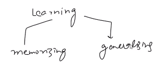
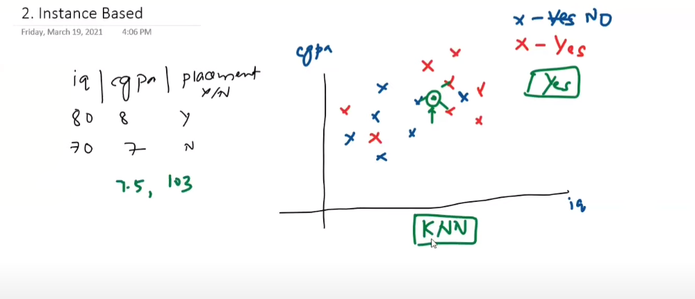
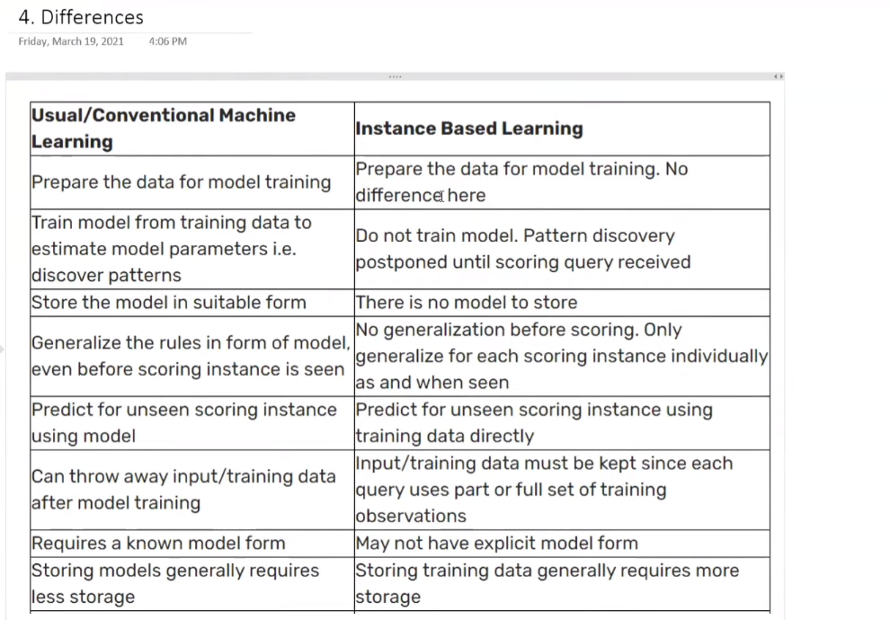

# Instance-Based Vs Model-Based Learning

- Memorizing ==> Instance based learning
- Genralizing ==> model based learning

# Instance based learning

- Do not learn
- It absically stores the data with itself, and whenever asked something answers directly
- Works based on similarity `Distance`. For example K-nearest neighbour.

# Model based learning

- Tries to understand behaviour of inner points of the data-points by drawing some mathematical functions
- Might draw a boundary

## Differences

