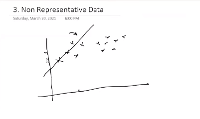
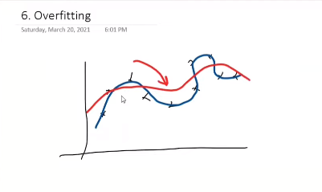
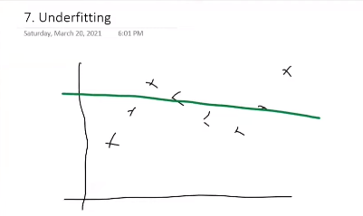

# Challenges in Machine Learning

## Data Collection

- ML is all about data.
- ML in actual life, data actuation/gathering is quite difficult.
- Two approaches
  - API calls
  - Web Scrapping

## Insufficient data/ labelled data

- Suppose `Algo a` is better algo than `algo b`. But If `algo b` is provided 5gb of data, and `algoA` with 100mb, then algo B will work better.

- **Unreasonable Effectiveness of Data** If we have Large amount of data, them we can use any algo.

- If we able to manage the data, will it be labelled.

## Non Representative Data

- Sometimes, data cant be represented on line, that is the following data can never be represebted by a line.

**Sampling Noise:**

**Definition:** Sampling noise refers to the variation or randomness introduced in data when a subset (sample) is chosen from a larger population for analysis. It arises due to the inherent variability within the population and the specific individuals or items selected for the sample.

**Example:** Imagine a study aimed at estimating the average height of all adults in a city. Instead of measuring everyone, a sample of 100 individuals is chosen. The differences in heights within the sample and the exclusion of some exceptionally tall or short individuals contribute to sampling noise. The average height calculated from the sample may not perfectly represent the true average height of the entire population due to this inherent variability.

**Sampling Bias:**

**Definition:** Sampling bias occurs when the process of selecting a sample from a population systematically favors certain outcomes, leading to a distorted or unrepresentative representation of the population. It results in a sample that is not reflective of the true characteristics of the entire population.

**Example:** Consider a survey about smartphone usage conducted by calling landline numbers during the day. This method introduces sampling bias because it excludes individuals who primarily use mobile phones and are not available to answer landline calls during working hours. As a result, the sample disproportionately represents a certain demographic (those likely to be at home with landlines during the day), leading to a biased view of smartphone usage patterns in the entire population.

## Poor Quality Data

Data has a lot of :
    - Outliers
    - missing values
    - Abrupt values
    - different format

Generally, in a project 60% of the time gets consumed while improving the data.

## Irrelevant Features

- Some solumns of data might not even contibute to the output
- **Garbage In, Garbage Out** ==> if you feed model with garbage, you will get the output as garbage

- Exaple : I want to conduct a marathon and I SMS a lot of people to take part in it. Now, I want to predict on the following basis if a person is goint to participate in the marathon or not.
So here :
  - Fitness ==> Important
  - Age ==> Important
  - `Location ==> Garbage`
  - Height ==> Important

- Solved using `feature engineering`

## OverFitting

- When model just rote(Ratna) learn the data.
- this type of model will fail when we feed a new data to the model
- One of the Biggest villian

**Overfitting Occurrence**: You decide to use a high-degree polynomial to precisely match each data point. For five data points, you choose a fourth-degree polynomial.

**Issue**: The fitted curve passes through each data point perfectly, achieving zero error during training.

**Result**: When you add a new data point not used during training, the high-degree polynomial may exhibit wild fluctuations between data points. This model has overfit the noise in the small dataset and fails to generalize well to new data, reflecting the noise instead of the underlying trend. In this smaller example, the overfit model may not accurately capture the true relationship between the variables.

The red line is desired , while blue is one which model built

## underfitting

- Opposite of Overfitting
- Not thinking much and making a small opinion

## Software Integration

- INtegration prooves to be tough

## Offline Learning/Deployment

- Offline learning takes time, and might not remain up to date
- Deployment prooves a lot costly

## Cost Involvement

- [The Cost of AI](https://research.google/pubs/pub43146/)

