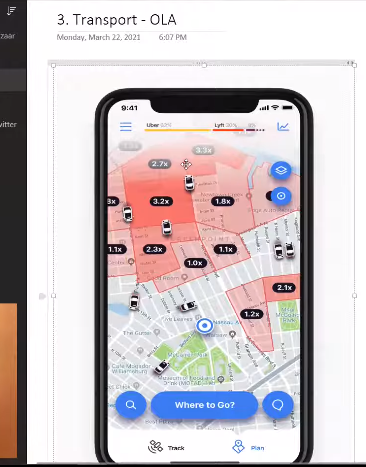

# Application of Machine Learning

## B2C (Business-to-Consumer) Applications of Machine Learning: (Generated using GPT)

1. **Personalized Recommendations:**
   - *Example:* Online retailers use machine learning to analyze customer preferences and behaviors, providing personalized product recommendations. Services like Netflix or Amazon suggest movies or products based on users' viewing or purchase history.

2. **Predictive Customer Analytics:**
   - *Example:* Businesses leverage machine learning to analyze customer data for predicting future behavior. This could include predicting customer churn, identifying upsell opportunities, or understanding customer lifetime value.

3. **Chatbots and Virtual Assistants:**
   - *Example:* Companies deploy machine learning-driven chatbots on their websites or through messaging apps to provide instant customer support. These bots learn from interactions to improve responses and offer a personalized experience.

4. **Fraud Detection and Security:**
   - *Example:* Financial institutions use machine learning algorithms to detect and prevent fraudulent activities. Anomalies in transactions, user behavior, or account access are identified in real-time to enhance security.

5. **Sentiment Analysis:**
   - *Example:* Brands analyze social media and customer reviews using sentiment analysis algorithms to understand public opinion. This helps businesses gauge customer satisfaction, identify trends, and respond to issues proactively.

6. **Dynamic Pricing:**
   - *Example:* E-commerce platforms and travel websites use machine learning to adjust pricing dynamically based on demand, seasonality, competitor prices, and user behavior. This allows businesses to optimize revenue in real-time.

7. **Customer Segmentation:**
   - *Example:* Retailers use machine learning to segment their customer base based on various criteria such as purchasing behavior, demographics, or preferences. This segmentation helps in targeted marketing and personalized communication.

8. **Voice and Image Recognition:**
   - *Example:* Virtual assistants in smartphones and smart home devices use machine learning for voice recognition. Additionally, image recognition is employed for visual search or augmented reality experiences in e-commerce apps.

9. **Dynamic Content Personalization:**
   - *Example:* Content-driven platforms, such as news websites or streaming services, use machine learning to personalize content delivery based on individual user preferences and browsing history.

10. **E-commerce Fraud Prevention:**
    - *Example:* Machine learning models are employed to detect and prevent fraudulent activities in online transactions, including credit card fraud, account takeovers, and identity theft.

## B2B

1) **Retail : Amazon/ Big-bazaar**
    1) Great indian festival sale
        - Want to predict which product's demand is going to spike in the sale.
        - Using previous years sale.
    - **Data Anakytics is used**
    2) The Big bazaar ask us our phone number at the counter as they use it to track our behaviour. And built our profile. And later this profile with our phone number is sold to other companies.  Also , they charge a lot . Because they siurely knows our tastes from our buying pattern. This data has a great conversion rate. Same is the case with Google, facebook, insta.
        - Used to categorize/select the proper position/group of the product. E.g. ==> Baby Diapers and beer in wallmart.
    - *If you are not paying for something, then you are the product*

2) **banking and finance**
    - I want to take a loan
        - I will submit my profile
        - then an ML analysis is done to check the chances of my farud with the company.
            - My profile is compared with the past defaulters of the loan and depending on the similarity, the loan application will be accepted/rejected.
        - then a manual check is done.
    - Similar is the case with finance

3) **Transportation OLA**
    - **Surge Pricing** = Higher red regions offers more price to the cab's drivers.
        - 
        - Now as price increase, the drivers tend to move to red zones so that so that they can earn more, and customers can have better facility.

4) **Predictive Maintainance**
    - Tesla takes orders before 6 months. Now , what if the rorbot installing the engine gets failed. So , they install IOT based sensors which tells the machine, that thir might be going to be failure, and correct it based on the previous data.

5) **Consumer Internet - Twitter**
    - Initially , twitter was not able to earn even a single penny .  so, investors felt that the twitter might get closed due to absenece of active source of revenue. So, the team planned to use `Sentiment Analysis` of the tweet. and used it to earn the money
    - Suppose elections are occuring in west bengal and twitter finds all the tweets related to this hashtag(`WB2021`). And check the tweets , their sentiments if they are going positive/negative for a particular election party.
    Lets say XYZ party wins.
    - Now whom to send this data :
        - News Channel ? Nopes
        - Sell it to stock brockers like JP morgan/Morgan Stanley
        - now , these investment firms invest their money into the companys backed by `XYZ` company.
    - Similar is the case with sports person/Actors

