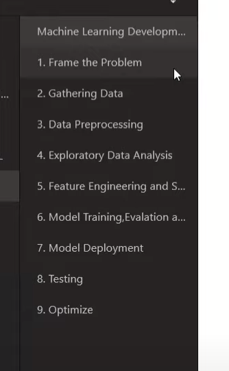

Till now , we have seen what and why Machine learning.
Now , lets focus on the How part

# Machine Learning Lifecycle

- More like software Engineering SDLC
- So, now to set procedures of developing ML models/software, a set of new guidelines were introduced known as `MLDLC(MAchine Learning Development Lifecycle)`
- interviewers want candidates with experience of building end to end product , not just models with their lifecycle

## Steps

(number might be different but try to understand the core idea)

1) **Framing the problem**
    - Before building a solution, we need to figure/frame out some features/problems.
        - Customers who?
        - Team size required?
        - Supervised vs Unsupervised model.
        - Offline vs online model
        - Platform's UI
        - Which algo to use
        - From where to source out the data

    - We cant start from scratch again and again because of cost issues

2) **Gathering the Data**
    - We students get the data from kaggle but thats not the case with big MNCs
    - Data Scarcity is there, and it is tought to arrange good quality data
    - Data Options
        - CSV files
        - API ==> JSON data
        - Web scrapping
        - Database
            - Cant run models on the live database, as that might cause issues in production
            - DataWareHouse is Built
        - Spark Clusters

3) **Data Preprocessing**
    - Data should be brought to such format that our machine learning model can consume
    - Data arranges from external sources is generally unclean.
        - Might have Structuring issues
        - Missing data
        - outliers
        - Noisy
        - Numbers of columns is diff in every data source
    - **What we do**
        - Remove duplicates
        - Remove missing values or fill them with mean/mediun/mode
        - remove outliers
        - Standarization ==> Scaling the values

4) **Explorartory Data Analysis**
    - We tries to study the data. Understand the data
    - Find the relationship b/w input and output
    - Generally done through
        - Visualization
        - Univariate analysis(Analyze every columns mean, standar deviation) ==> BiVariate Analysis ==> MultiVariate Analysis
        - Outliers detection
        - Finds imbalances so that we can tend to reduce the bias of the final model
    - Like an axe-man if tries to cut the tree with the bllunt axe, then it will take a lot of time, but if tries to cut the same with the sharper one, then however it will take a good amount of time in the beginnig but it is going to take less time.

5) **Feature engineering and Selection**
    - Input ==> feature
    - The core idea of feature engineering is sometimes, we tend to create some new columns as per our analysis, so that it becomes easy.
    - Like i want to predict the house price, then i may simply remove the number of bathrooms, and number of rooms column. And merge them under the name of sq. feet area.
    - **Selection** Sometimes, we have a lot of features say 100-200. Because a lot of features might just be garbage. Secondly, higher the number of solumns, higher time the model takes to train itself

6) **Model Training , evaluation and selection**
    - **training Stage** We tries a lot of algos, and tries to train the model on various algos (because we never know which will fits the best)
    - **Evaluation**
        - Done based on performance matrixs such as confusion matrix, 
        - Accuracy for classification
        - MSE for regression
        - terms index for clustering
    - **Selection** Selects one/many models and tune their parameters
        - we might do `Ensemblence Learning`, where we merges many algos, to get the best of all

7) **Model Deployment**
    - Till , now we have built the model. Here comes the final work, of integrating it in the software and deploy it.
    - The model's file is generally gerated using tools such as `pickel`, and now the following file is converted into an API, which can be used later.

8) **Testing**
    - Generally beta testing is done now
    - A/b testing is also done. If result good, then move to next step , else reperat steps from 1 to 7.

9) **optimize**
    - Model Backup
    - Data backup
    - If the model doesnt work then we can have a option to roll back.
    - Load balancing
    - Frequency of retraining (Because of `rotting` .It is the phenomena of degradation of models performance over time due to change in the data/user patterns.). Also, this is tried to do automated.
