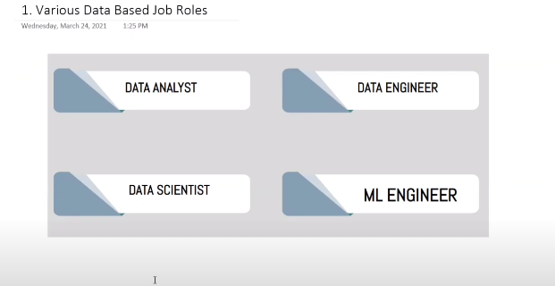
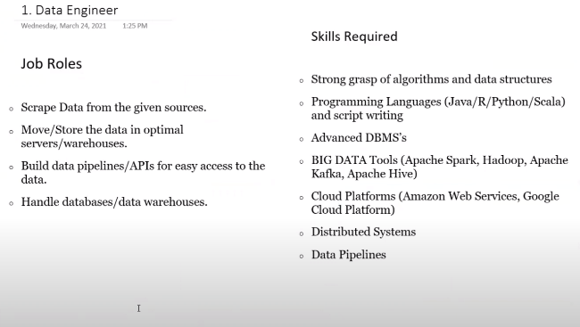
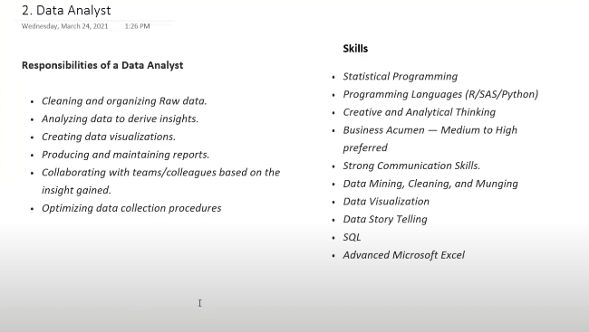
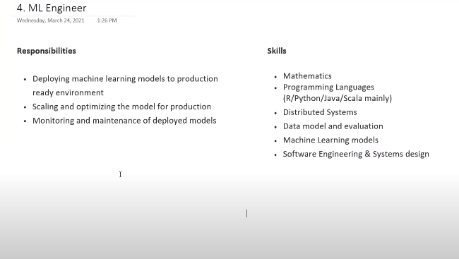
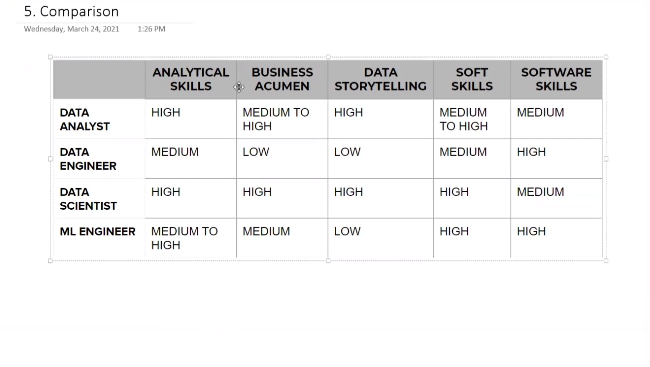

# Job profiles in ML field

## Data Engineer

- **OLDP**  ==> Online Transaction Processing
  - This is the live database
- **OLAP** ==> Online Analytical Processing
  - This is our Data Warehouse.

- Data Engineer is primarily reponsible for converting OLDP data into OLAP

- **Pipelines** ==> APIs which are going to be used by Analytical team
- Building and maintainance of these pielines, OLDP, OLAP.

- High salary since resources to become a good data engineer are very low.

## Data Analyst

- Reponsible for data analysis and cleaning of the data.
- Basically, summarize past events which happened in the data.

- Data analyst is similar to business analysyt. but data is mre focused on engineering, but buiseness one is more on maangement

## Data/Decision Scientist

- A data scientist is someone who is better at statistics tham any softeare engineer and better at software engineering than any statistician.
- Can do every work of `MLDC`
- They focus on future while data anakysts focussed on past
- Main guy

## ML engineer

## Comparision

