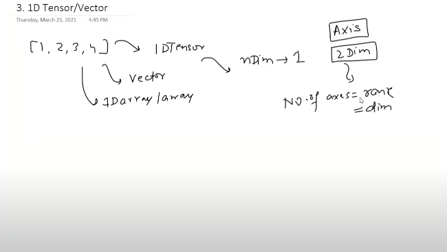
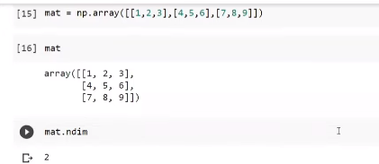

# Tensors

- Tesnsors are more like a data structures.
- tensorflow, scikitlearn all uses tensors at the back
- A container for numbers in majorly cases. Otherwise, it may store characters/strings.
- `Vectors/matrices all are tensors from 1d to n-dimesnions`

**AXIs**
    - Number of dimensions
    - Number of axir = `rank` = dimensions

## 0D tensors/scalar

In the context of tensors, a 0-dimensional tensor is essentially a scalar, representing a single numerical value. In Python and NumPy, you can create a 0-dimensional tensor using the `numpy.array()` function with a single value.

Here's a short example:

```python
import numpy as np

# Creating a 0-dimensional tensor (scalar) in NumPy
scalar_tensor = np.array(42)

# Displaying the tensor
print(scalar_tensor)
```

In this example, `scalar_tensor` is a 0-dimensional tensor with the value 42. It is essentially a single element without any axes or dimensions.

## 1D tensor



Example:

```python
arr = np.array([1, 2, 3,4])
print(arr.ndim) #Ouputs 1
```

- 1d tensor is also known as vector
  - But if someone asks me the dimension of the above vector then the answer will be 4.
  - [1, 2] is also a 1d tensor but with a 2 dimension vector.

- Tensor is a collection of multiple n-1 d tensors
- A vector is a collection of scalars
- A matrix is a collection of vectors.

## 2d matrices




## nd tensor


## Rank ,axes, shape

`Number of axis =  Rank = No. of dimensions`

`Shape ==> number of items in every axis`


`size of tensor = totl items. Multiply everyhting inside the shape`