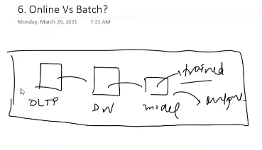

# Business Problem to ML problem

Suppose, we are the `lead data scientist` at `Netflix`. (Ofc, we r not, elsewise not reading my notes `:)` ).
We are planning to improve the profit.

- Three Ways
  - Get new Customers
  - Make existing customers pay for more
  - Prevent the customers from leaving the platform. That is to reduce the `Churn Rate`.

`Terminology Alert` ==> Churn Rate is % of customers who will leave the platform after a particular duration.

`Step 1 ==> To convert the problem into a mathematical one.` Like from increasing revenue to Decreasing curn rate.

## Type of The problem

Now , we have to see the bigger picture.

1) Big Picture
2) Focus on End Product
3) Predict What?  Those customers who are going to leave the platform.
    - So this becomes classification now. Further, I want to know how badly he wants to leave the platform, so this is a regression problem not a classification one.
4) Identify problems for them and offer solution like
    - Offer x% discount where x is % of chance one person wants to leave the platform.
    - Identify problem and add/recommend content accordingly.
    -

## Current Solution

- Get to know what already team is doing/using.
For example : Here we will be interested in which factors were contributing to the churn rate.

## get data

- Can include
  - Watch Time
  - Search but didnt find
  - Content left in the middle
  - Clicked on recommendation(order of recommendation)
So, now get a data engineer and ask him to provide us a warehouse of data, containing the above columns.

## Metrics to measure

Metrics to measure models performance,
like testing how good the model performed.
further, if the model predicted 4% and it has (a, b, c, d) but users which left the platform are : (w, x, y, z). Then the model is wrong.

## Online or Batch?

Are we going to use Online Learning or Batch learning.
I might have gone for online one since lockdown increased the viewership. Similar with holidays

## Check Assumptions

Whther my features selected are even available for use or not?